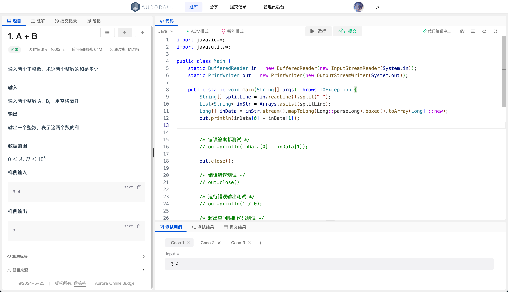
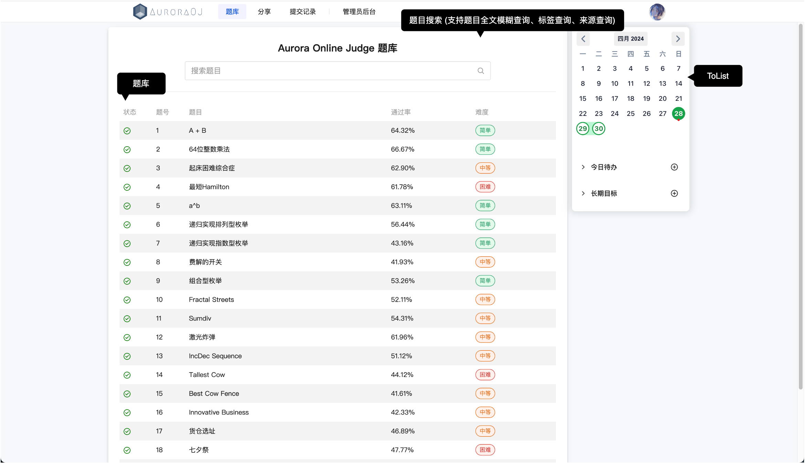
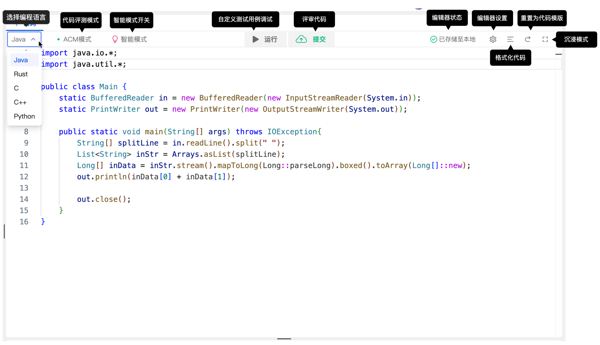
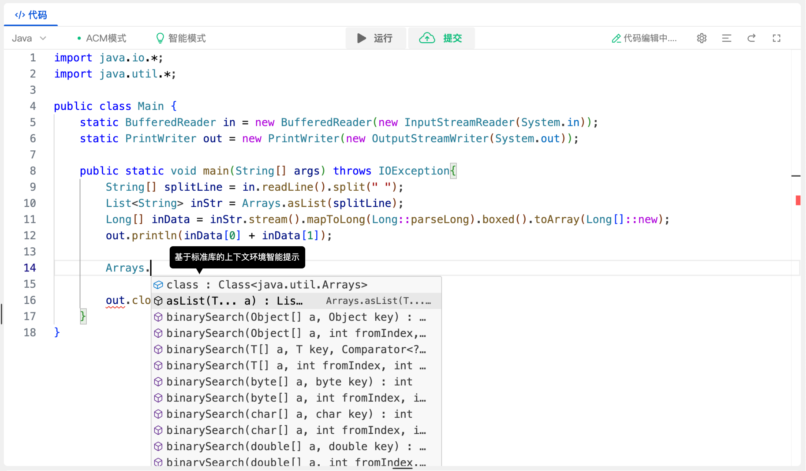
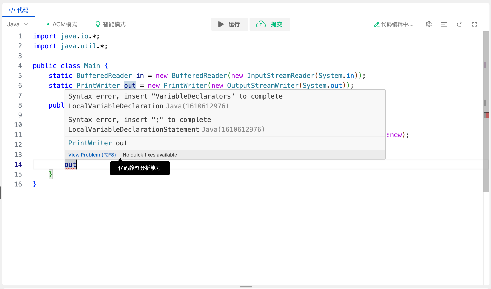

# Aurora Online Judge Front End
Aurora OJ 是我的本科毕设 —— OJ 系统的前端实现，采用 Vue.js 框架和 [Tdesign](https://tdesign.tencent.com/) 和 [NativeUI](https://www.naiveui.com/zh-CN/os-theme) 搭建，由于时间有限，仅实现核心功能页面，具体实现的页面有： 

- 做题页面 

  - 题目描述页 (基于 md-editor-v3 实现) 

  - 代码编辑器 (基于微软开源的 Monaco Editor 实现, 结合 LSP 实现 C,C++,Rust,Python,Java五种语言的代码智能提示)

  - 自定义多测试用例和测试结果显示页 (模仿 [LeetCode]() 的同样功能功能实现)

- 题解页
- 笔记页
- 提交记录页
- 题目搜索页
- 个人信息页

### 具体效果图

### 搭建环境要求：

- Node.js 20 +
- nom 10 +
- 相关编程语言的 Language Server

| Language |                       Language Server                        |                  Maintainer                  |
| :------: | :----------------------------------------------------------: | :------------------------------------------: |
|    C     | [clangd](https://github.com/llvm/llvm-project/tree/main/clang-tools-extra/clangd) |                 LLVM Project                 |
|   C++    | [clangd](https://github.com/llvm/llvm-project/tree/main/clang-tools-extra/clangd) |                 LLVM Project                 |
|   Java   | [Eclipse JDT LS](https://github.com/eclipse-jdtls/eclipse.jdt.ls) |                   Eclipse                    |
|   Rust   | [rust-analyzer](https://github.com/rust-lang/rust-analyzer)  | [Aleksey Kladov](https://github.com/matklad) |
| Python3  |        [pright](https://github.com/microsoft/pyright)        |                  Microsoft                   |

